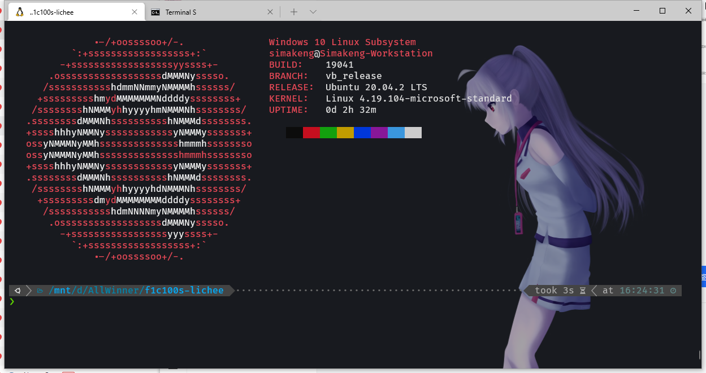
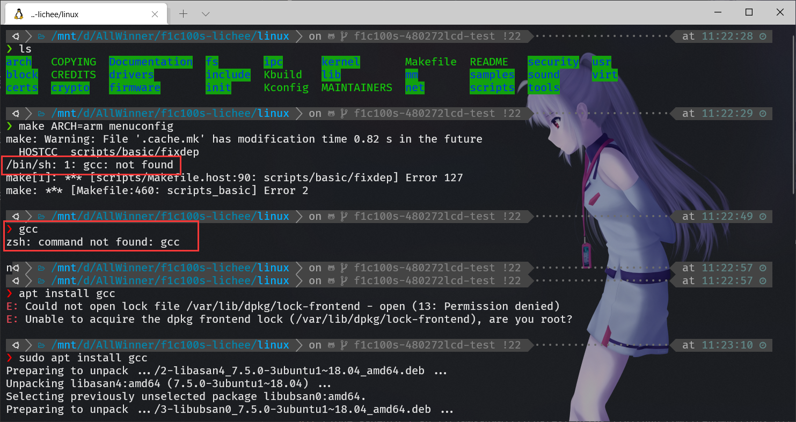
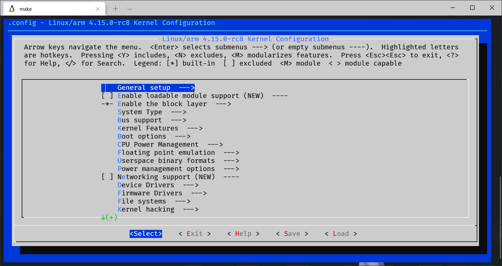
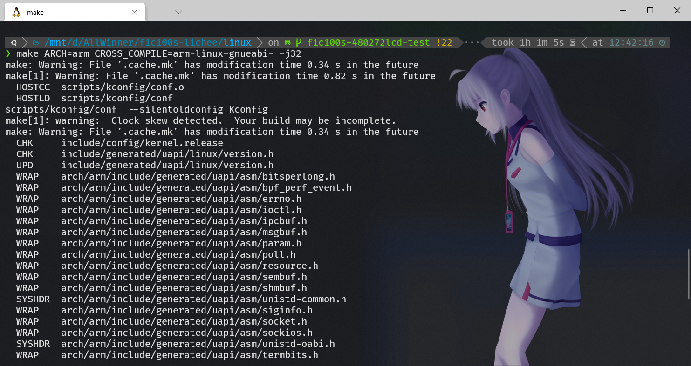

# 下载并编译 Linux 源码的流程

 下文编译环境均为 Windows Subsystem for Linux 虚拟机中的 Ubuntu 20.04.2 LTS。




## 1. 从 github 拉取源代码
```bash
git clone https://github.com/Icenowy/linux.git
```

完整拉取太慢，也可以考虑拉取下面这个有配置的分支

```bash
git clone --depth=1 -b f1c100s-480272lcd-test https://github.com/Icenowy/linux.git
```
## 2. 进行配置
使用如下命令进行编译
```bash
make ARCH=arm menuconfig
```
如果发现报错 ```/bin/sh: 1: gcc: not found``` 则是没有找到 gcc 编译器，

执行```sudo apt install gcc```安装即可



成功编译后的配置界面如下



如果嫌麻烦可以直接下载配置好的文件:[点我下载](files/.config)

覆盖进去之后进行编译

```bash
make ARCH=arm CROSS_COMPILE=arm-linux-gnueabi- -j32
```



### 常见错误：
#### 1. openssl/bio.h: No such file or directory
```bash
scripts/extract-cert.c:21:10: fatal error: openssl/bio.h: No such file or directory
 #include <openssl/bio.h>
          ^~~~~~~~~~~~~~~
compilation terminated.
```
原因：未安装 libssl-dev
解决方法:
```bash
sudo apt install libssl-dev
```