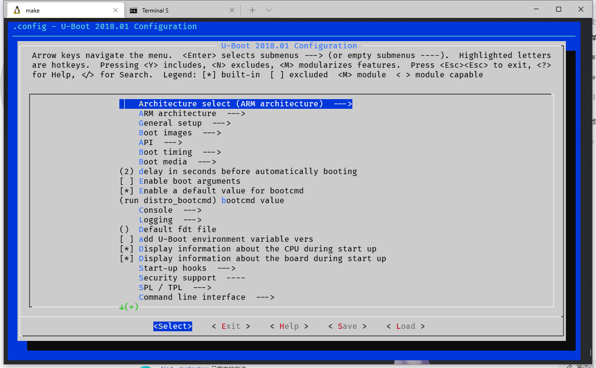
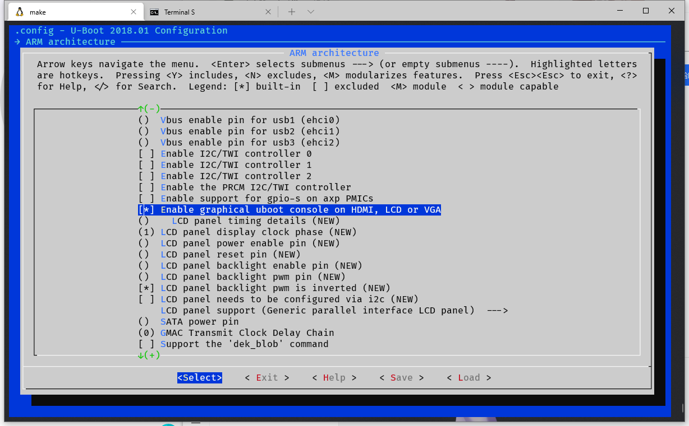
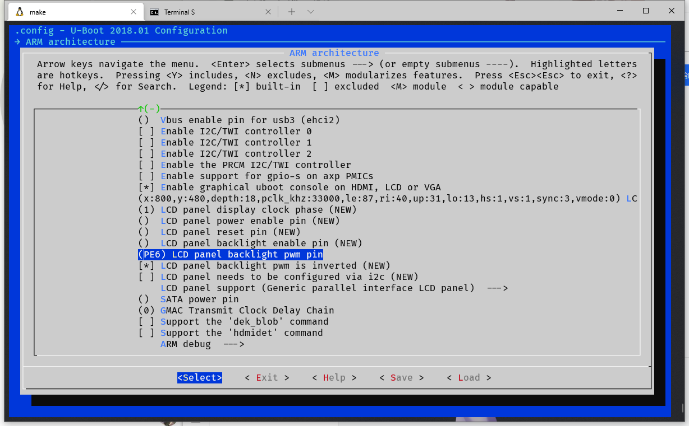
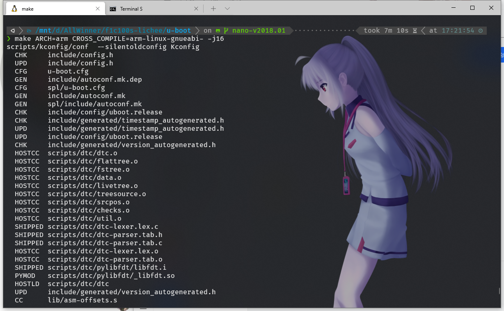
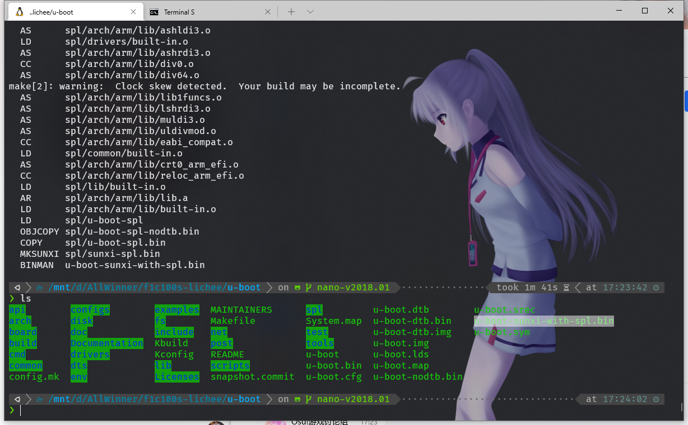

# 下载编译uboot流程

注意，该流程需要arm-linux-gnueabi-交叉编译器，make等一系列linux下的命令，在windows下编译总是会遇到奇奇怪怪的问题，肥肥于2021年2月2日放弃了这个想法

 下文编译环境均为 Windows Subsystem for Linux 虚拟机中的 Ubuntu 20.04.2 LTS。


## 1. 从GitHub拉取u-boot

官方仓库是[https://github.com/u-boot/u-boot](https://github.com/u-boot/u-boot)，但是没有F1c100s的代码支持，所以要从第三方维护的[https://github.com/Lichee-Pi/u-boot.git](https://github.com/Lichee-Pi/u-boot.git)里面拉取直接能用的uboot。

```bash
# 拉取代码
git clone https://github.com/Lichee-Pi/u-boot.git
# 进入刚刚拉取的目录
cd u-boot
# 切换到 Nano 分支
git checkout nano-v2018.01
```

## 2. 配置u-boot

执行menuconfig改一下配置
```bash
# 初始化默认配置
make ARCH=arm menuconfig
```




开源板卡Lichee-Nano的芯片方案就是F1C100S，**这里可以直接通用他们的配置文件：**

```bash
# 初始化默认配置
make ARCH=arm CROSS_COMPILE=arm-linux-gnueabi- licheepi_nano_spiflash_defconfig
```

若要在如果想在LCD上输出显示，把 ARM architecture ‣ Enable graphical uboot console on HDMI, LCD or VGA 设置为 Y



并且需要配置好屏幕参数，如果是480x272的屏，填写如下参数:
```bash
# 480x272
x:480,y:272,depth:18,pclk_khz:10000,le:42,ri:8,up:11,lo:4,hs:1,vs:1,sync:3,vmode:0
```
800x480:
```bash
# 800x480
x:800,y:480,depth:18,pclk_khz:33000,le:87,ri:40,up:31,lo:13,hs:1,vs:1,sync:3,vmode:0
```
并且按照板卡参数填写LCD背光PWM引脚

荔枝派Nano的引脚是```PE6```

填好如图:



## 3. 编译 u-boot

没啥好说的，奥利给就完事了
```bash
# 开始编译
make ARCH=arm CROSS_COMPILE=arm-buildroot-linux-uclibcgnueabi- -j8
```


编译好可以看到一个```u-boot-sunxi-with-spl.bin```文件，这就是编译完的程序


## 4. 烧录进flash

需要准备 ```sunxi-fel``` 没有的话要自己编译，windows编译需要MinGW