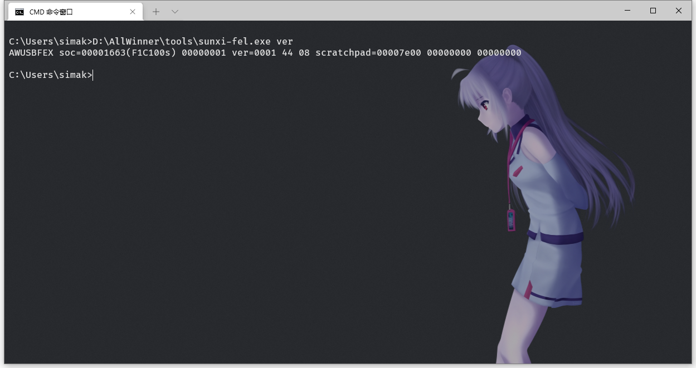

# 使用 sunxi-tools 烧录
```
TLNR：这篇笔记完整记录了在Windows使用sunxi-tools烧录的过程
```
## 1. Windows 下烧录至spi-flash

众所周知 Windows 是不原生支持`libusb`的，而`sunxi-fel`使用`libusb`和设备通讯，所以需要使用`zadig`模拟。

官网:
[https://zadig.akeo.ie/](https://zadig.akeo.ie/)

2020.03.28更新的Zadig 2.5:
[https://github.com/pbatard/libwdi/releases/download/b730/zadig-2.5.exe](https://github.com/pbatard/libwdi/releases/download/b730/zadig-2.5.exe)

先准备设备，让它进入fel模式

拔掉TF卡，通过短路`1`-`4`脚（`GND` 和 `CS`）的方式让芯片识别不到spi-flash，然后连接USB线到电脑，就会成功识别`USB-FEL`
这块板子因为经常被我拿镊子短路不方便，我焊了个按钮上去


接好线之后打开zadig，选择列出所有设备：


然后应该就会出现


因为没驱动，很可能就是这个`Unknow Device #1`，保险起见可以去设备管理器里面看一下。


安装驱动


安装好就是这样


执行
```bash
sunxi-fel ver
```
可以看到设备已经检测到了



烧写命令:
```bash
sunxi-fel spiflash-write [烧进去的起始位置] [要烧写的镜像文件路径]
```

例：
```bash
sunxi-fel spiflash-write 0 u-boot-sunxi-with-spl.bin
```