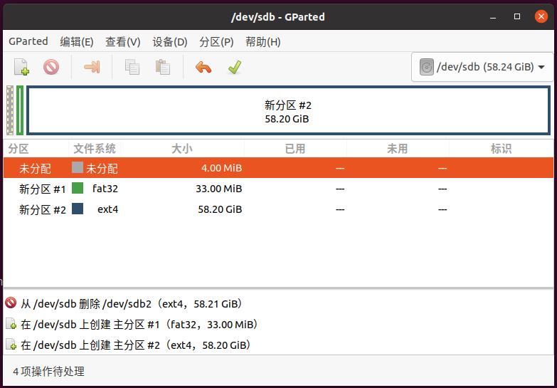
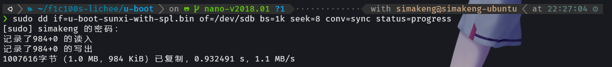
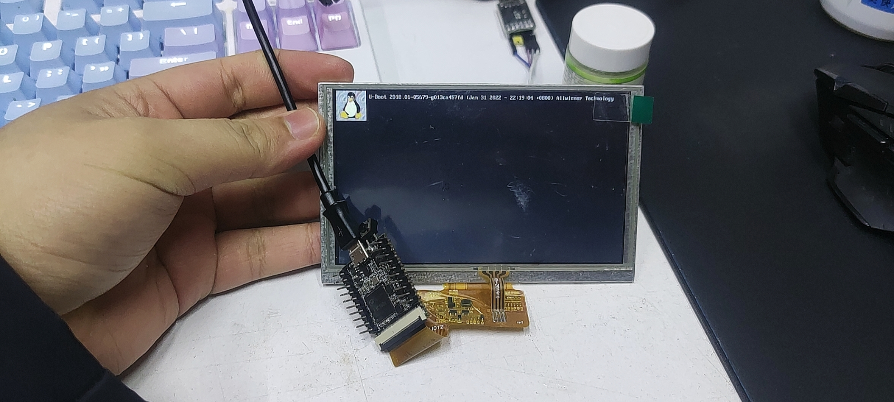
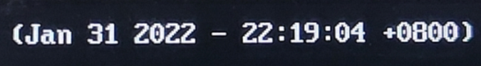
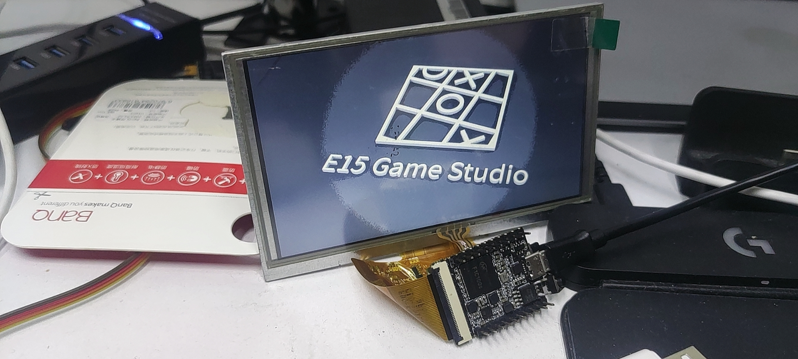
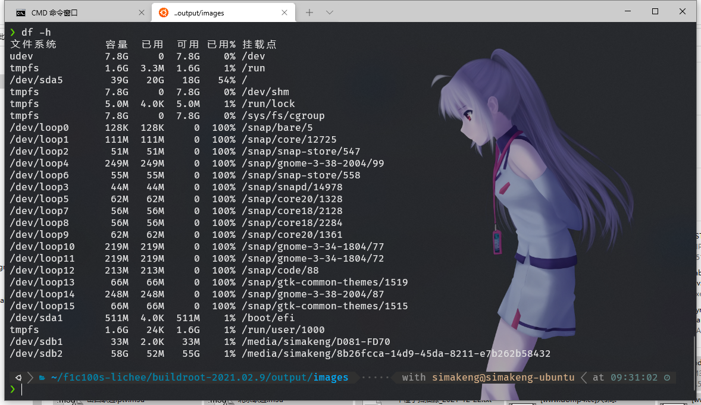
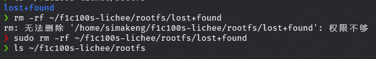
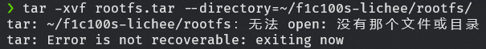
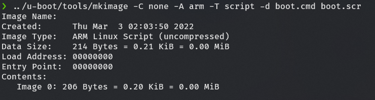

# 制作可引导的TF卡

##  拿到新U盘：

先用分区工具把盘分成两个区，如下图

记得在前部预留一个空间，用来保存uboot引导代码，空间长度取决于编译后的uboot尺寸。

我这里uboot是1MB，给留了4MB空间，如果你的 uboot 改了 logo 之类的可能会大一点。

FAT32 空间用来放设备树和 Linux 内核，32MB绰绰有余
EXT4 空间用来放系统根文件系统


### 第一步 烧写 uboot

把编译好的 uboot 写入预留的空间

```bash
sudo dd if=<uboot> of=<盘符> bs=1k seek=8 conv=sync status=progress
```



这个时候已经可以上电看看有没有成功了


如果显示的编译日期和你的uboot的编译日期对上的话，说明现在已经开机了


如果你想改开机图片，除了网上搜到的教程的步骤，编译前记得清除编译缓存

```bash
make clean
```

2022年3月2日 肥肥改好了 LOGO:



### 第二步 烧写rootfs

复制buildroot编译生成的tar.gz文件到ext4分区内，解压就行

具体步骤：
#### 1. 创建分区挂载点

创建一个空文件夹作为待会映射分区文件的根目录
```bash
mkdir ~/f1c100s-lichee/rootfs
```

#### 2. 挂载分区
ubuntu 下会自动挂载USB存储设备的分区，如果需要确认是否已经挂载，使用命令:
```bash
df -h
```


如果已经挂载，用如下命令解除：
```bash
sudo umount /dev/sdb1
```

然后挂载即可
```bash 
sudo mount -w /dev/sdb2 ~/f1c100s-lichee/rootfs
```
如果ls发现有 `lost+found` 文件夹可以直接删掉，ubuntu创建的回收站



#### 3. 解压 rootfs

```bash
tar -xvf rootfs.tar --directory=/home/simakeng/f1c100s-lichee/rootfs/
```
注意 `tar` 的 `--directory` 参数要用绝对路径
如果提示没有目录，排除填错路径，可能是权限不够


更改权限就行
```bash
sudo chmod u=rwx,g=rwx,o=rx ~/f1c100s-lichee/rootfs
udo chown -R simakeng:simakeng ~/f1c100s-lichee/rootfs
```

### 第三步 生成引导文件

新建 `boot.cmd` 文件，写入如下内容

```bash
setenv bootargs console=tty0 console=ttyS0,115200 panic=5 rootwait root=/dev/mmcblk0p2 rw
load mmc 0:1 0x80C00000 suniv-f1c100s-licheepi-nano.dtb
load mmc 0:1 0x80008000 zImage
bootz 0x80008000 - 0x80C00000
```

调用 `u-boot` 的 `mkimage` 生成 `boot.scr` 文件

```bash
../u-boot/tools/mkimage -C none -A arm -T script -d boot.cmd boot.scr
```

