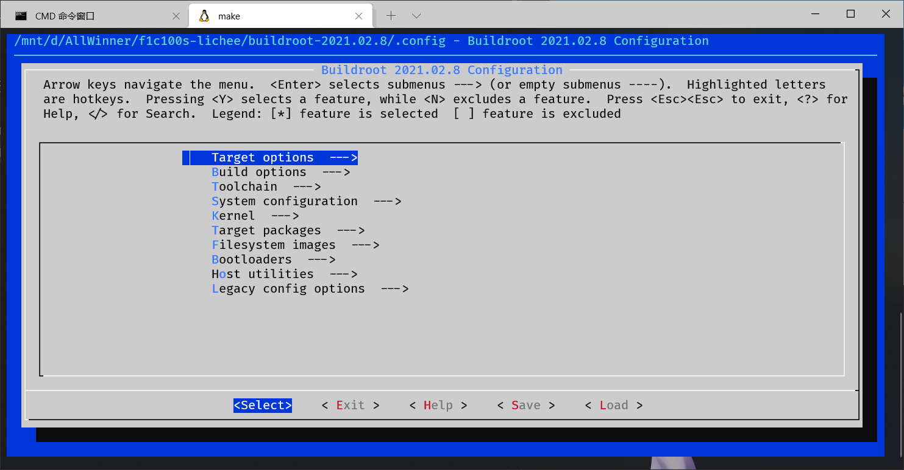
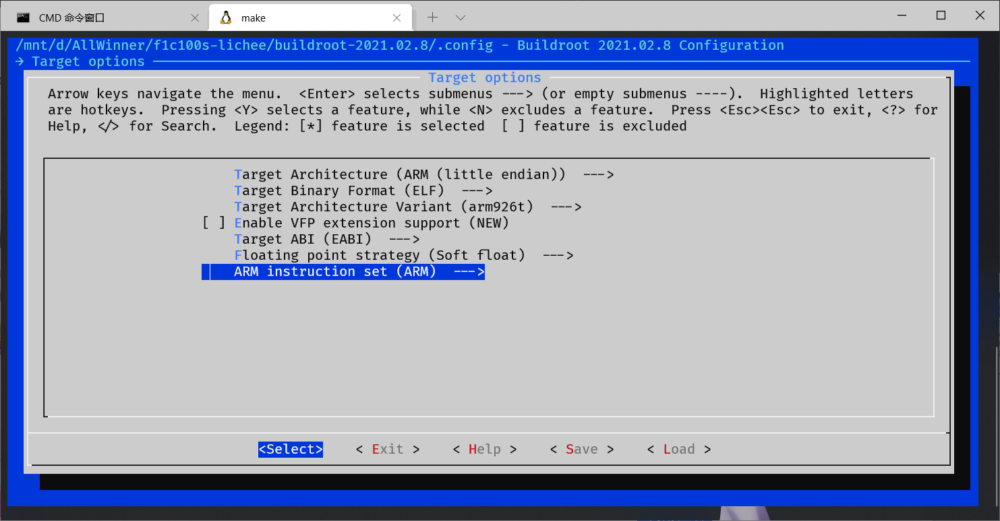
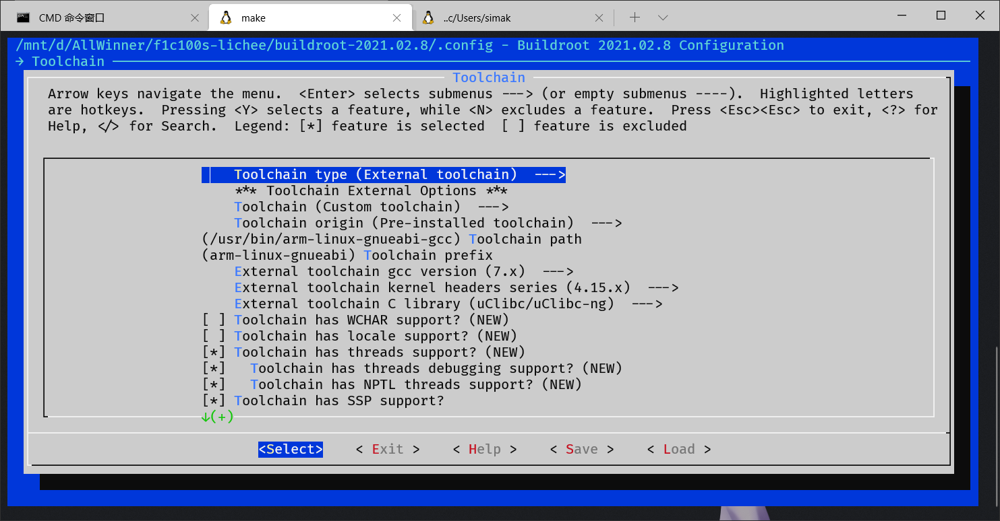
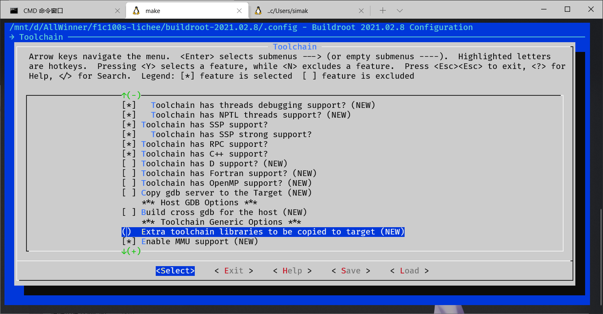
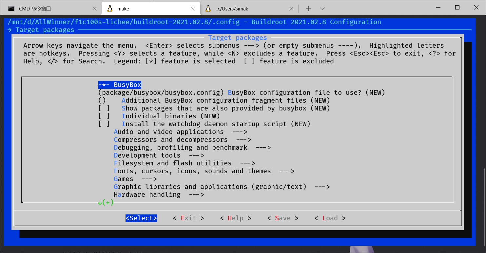

# 根文件系统


首先去[官网](https://buildroot.org/)下载最新的buildroot

下载好之后**务必**使用 `tar -xvf` 命令解压
```bash
tar -xvf buildroot-2021.02.8.tar.gz
```

然后cd进入刚刚解压的目录，`make menuconfig` 编译
```bash
cd buildroot-2021.02.8
make menuconfig
```

进入配置界面开始配置



### `Target Options`中：
- `Target` 设置为 `ARM(little endian)`
- `Target Architecture Variant` 设置为 `arm926t`



### `Toolchain` 中：

太多了，看图吧：




### `Target Package` 中：

按需配置需要安装的程序包
比如 git, python之类的

