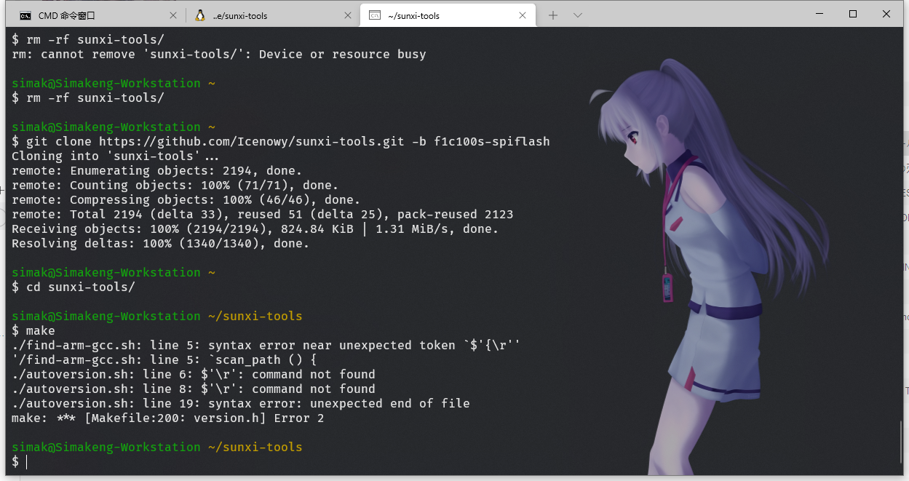
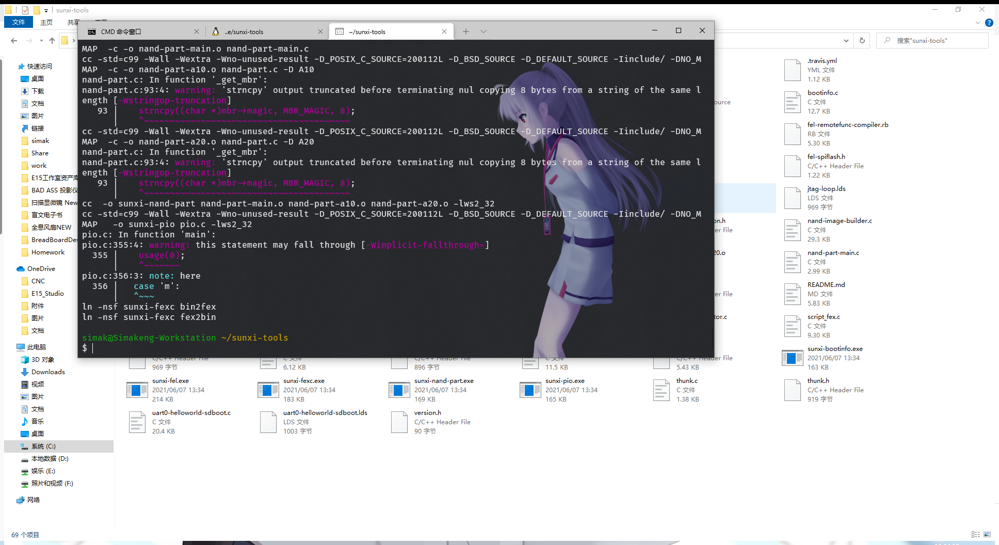

# 烧录工具 sunxi-tools 编译

`sunxi-tools` 是开源社区 [https://linux-sunxi.org/](https://linux-sunxi.org/) 维护的 `fel` 模式芯片操作工具，提供了烧录，启动等功能。

编译步骤比较麻烦

## 1. 在 linux 系统中编译
**该步骤未测试**

### 1.1. 安装 `libusb-1.0` 和 `zlib`

`apt` 包管理器:
```bash
apt install libusb-1.0-0-dev zlib1g-dev
```

`yum` 包管理器:

```bash
yum install libusbx-devel
```

### 1.2. 拉取 ```sunxi-tools```
```bash
git clone https://github.com/Icenowy/sunxi-tools.git -b f1c100s-spiflash
```

### 1.3. 编译
```bash
make
```

## 2. 在 Windows 下编译

**该步骤已由肥肥在2021年6月7日13:35:29测试通过**

**注意：`Windows` 系统下需要在 `cygwin64` 环境中编译**
~~而且有非常多的奇奇怪怪的bug~~

需要在`cygwin`中安装`libusb-1.0-0-dev` `zlib1g-dev`库

### 2.1. 拉取```sunxi-tools```
```bash
git clone https://github.com/Icenowy/sunxi-tools.git -b f1c100s-spiflash
cd sunxi-tools
```

**确保 `autoversion.sh` 和 `find-arm-gcc.sh` 的换行符是 Unix 换行符`LF`而不是 Windows 换行符 `CR` `LF`**


**如果报这个错说明换行符不对，需要先删除`version.h`然后再处理换行符**

编译好应该就有了
