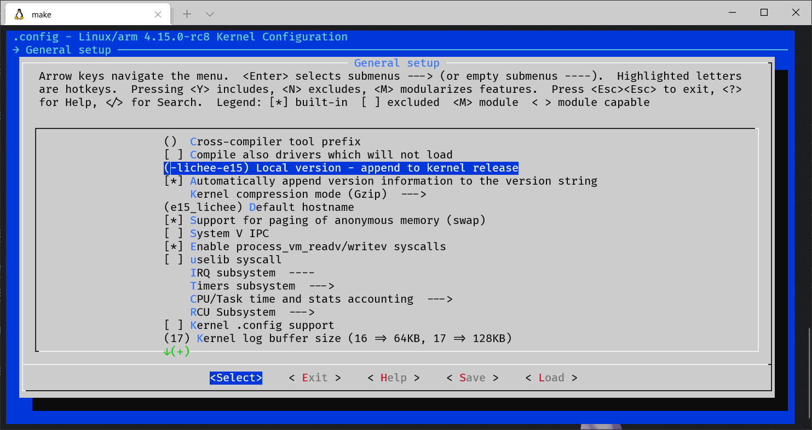
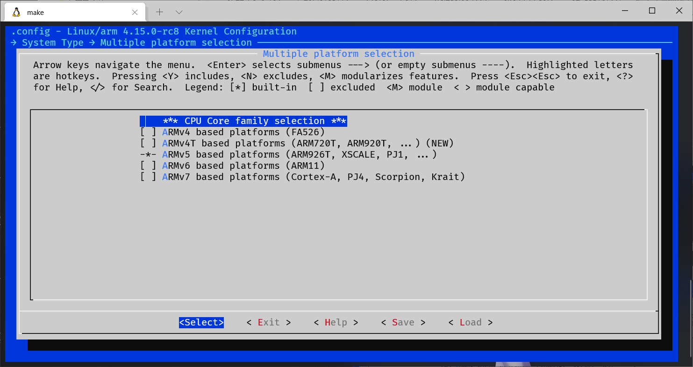
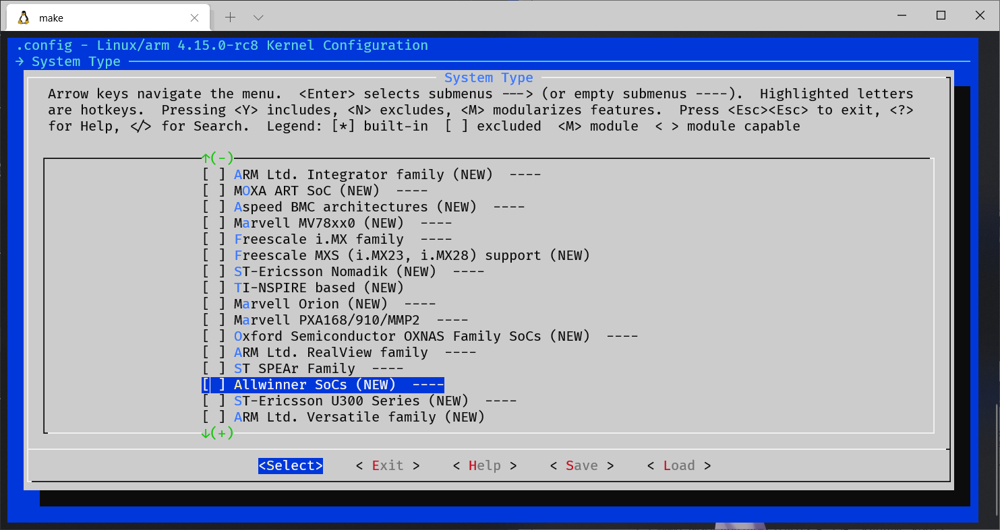
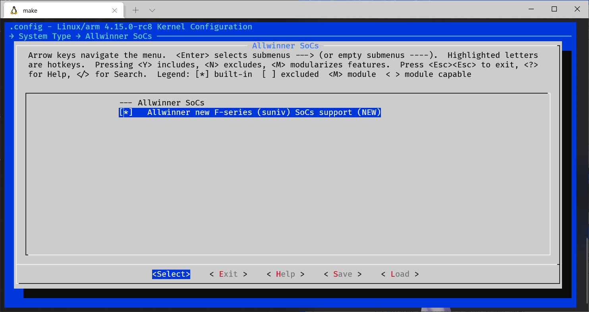
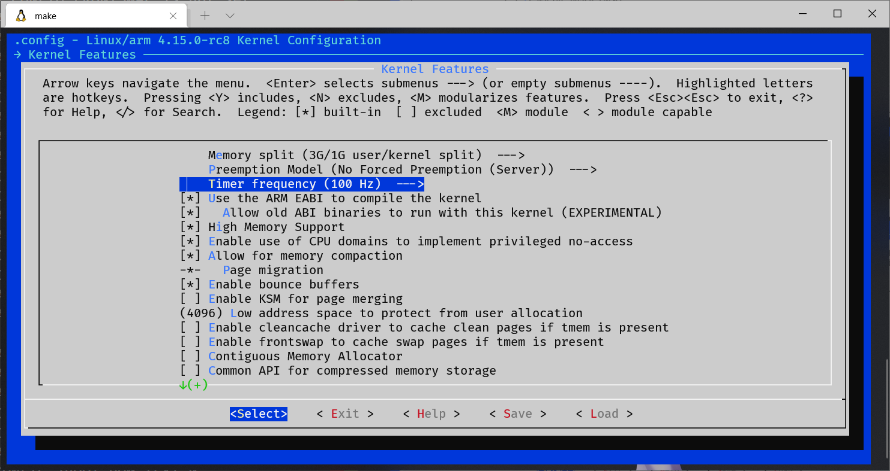
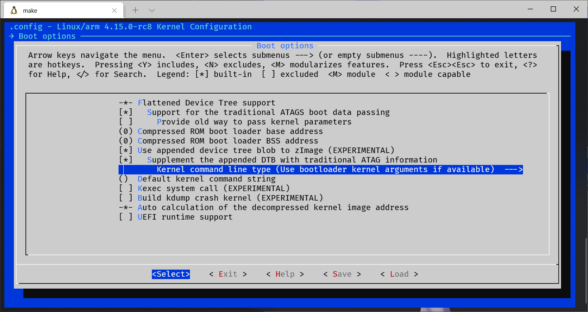
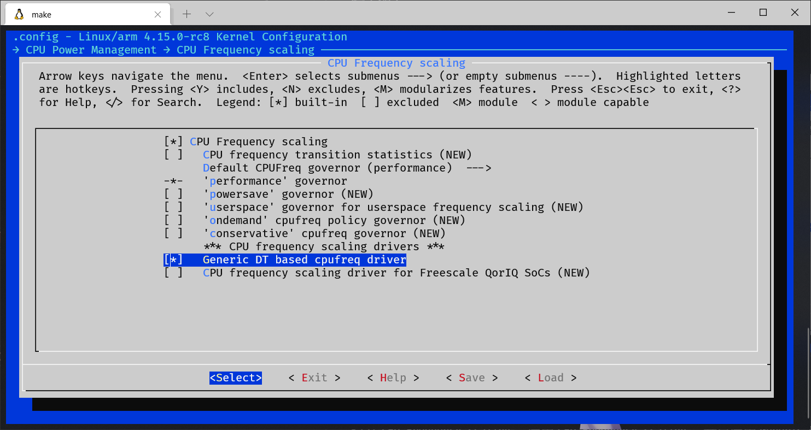
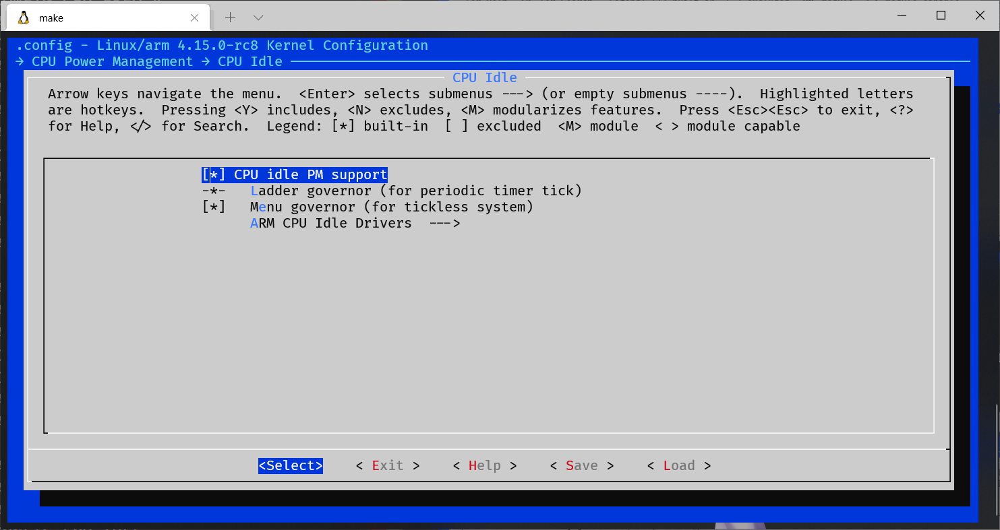
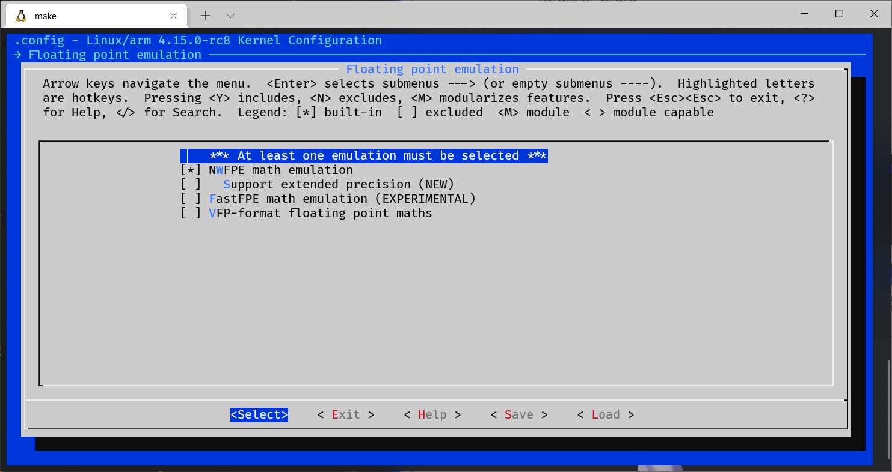

# 配置文件逐行分析

以下内容是以[这个文件](files/.config)为目标进行逐行比对得出的配置方式

### 1. ```General setup``` 中：
- ```Local version```（自定义版本号后缀）可以修改
- ```Default hostname```（默认主机名）可以修改



### 2. ```System Type``` 中

```Multiple platform selection``` 按```N```取消选中```ARMv6```和```ARMv7```，确保只有  ```ARMv5``` 被选中 。



下拉菜单找到 ```Allwinner SoCs``` 并按```Y```选中



再按```Enter```进入二级菜单确保```Allwinner new F-series``` 也被选中



### 3. ```Kernel Features``` 中
选中如下:
- ```Use the ARM EABI to compile the kernel```
- ```Allow old ABI binaries to run with this kernel```
- ```High Memory Support```



### 3. ```Boot options``` 中
选中如下:
- ```Use appended device tree blob to zImage```
- ```Supplement the appended DTB with traditional ATAG information```



### 4. ```CPU Power Management``` 中 

打开```CPU Frequency scaling```，启用```CPU Frequency scaling```，并且启用```Generic DT based cpufreq driver```



在上一级菜单中进入```CPU Idle```
选中 ```CPU idle PM support``` 和 ```Menu governor (for tickless system)```


再进入```ARM CPU Idle Drivers``` 选中 ```Generic ARM/ARM64 CPU idle Driver```

### 5. ```Floating point emulation``` 中 

选中 ```NWFPE math emulation```



<p align="right">未完待续 肥肥 于 2022年1月26日</p>
